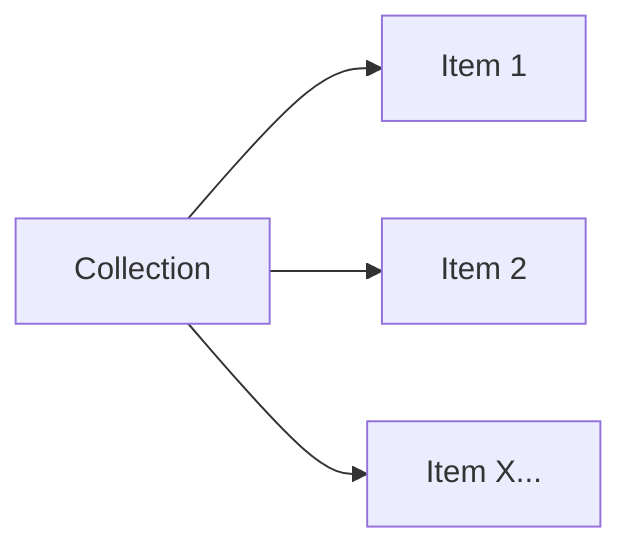

# Collection

## Logic Structure (Parent / Child)



## Interfaces
The most common use of ordinal inscriptions today is to inscribe a collection of collectables. Particularly relevant metadata protocols are {@link OOMD.Collection Collection} and {@link OOMD.Attributes Attributes}:

Protocol
```ts
interface Collection {
    name: string;
    description?: string;
    totalCount?: number;
    url?: string;
    allAttributes?: { [_: string]: (string | number)[] };
}
```

Protocol
```ts
interface Attributes {
    [name: string]: (string | number)[];
}
```

## Collection

First, inscribe the collection parent for the collection, follwing the {@link OOMD.Collection Collection} metadata protocol:

Metadata
```json
{
    "collection": {
        "name": "Tiny Vikings",
        "description": "Tiny Vikings are the vikings of Bitcoin.",
        "totalCount": 20000,
        "url": "https://tinyvikings.xyz",
        "allAttributes": {
            "Background": [ "Snowy", "Gold", "..." ],
            "Outfit": [ "Green Cloak", "Wizard", "..." ],
            "Skin": [ "Classic", "..." ],
            "Headwear": [ "Fire", "..." ],
            "Beard": [ "Loki’s Mischief (Blonde)", "..." ],
            "Eyewear": [ "Night Vision", "..." ],
            "Tool": [ "Axe" "..." ],
        }
    }
}
```

Note that the {@link OOMD.Collection Collection} should include all available attributes that is present in the {@link OOMD.Collection Collection}.

## Items

Then, inscribe the items as a child of the collection, following a combination of the {@link OOMD.Common Common} and {@link OOMD.Attributes Attributes} protocol:

Metadata
```json
{
    "name": "Tiny Viking #0",
    "attributes": {
        "Background": "Snowy",
        "Outfit": "Green Cloak",
        "Skin": "Classic",
        "Headwear": "Fire",
        "Beard": "Loki’s Mischief (Blonde)",
        "Eyewear": "Night Vision",
        "Tool": "Axe"
    }
}
```