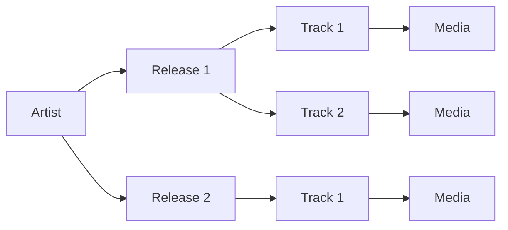

# Music

## Logic Structure (Parent / Child)



## Inferfaces
When inscribing a music there are a few relevant metadata protocols: {@link OOMD.Artist Artist}, {@link OOMD.Release Release}, {@link OOMD.Track Track} and {@link OOMD.Media Media}:

```ts
interface Artist {
    description?: string;
    name: string;
    releases?: Linked<Release>[];
}
```

```ts
interface Release {
    artists?: (string | Linked<Artist>)[];
    cover?: Link;
    date?: Date;
    title: string;
    tracks?: Linked<Track>[];
    type: string;
}
```

```ts
interface Track {
    artists?: (string | Linked<Artist>)[];
    releases?: (string | Linked<Release>)[];
    title: string;
}
```

```ts
interface Media {
    decoder?: Link;
    duration?: number;
}
```

Here is an example of what the metadata for a single track can look like:

```json
{
    "track": {
        "title": "Dream"
    },
    "media": {
        "duration": 69.68299999999999,
        "decoder": {
            "@id": "6a96a763093b30319ab9f38e5043405c4853e72c86eb1107dbf92f68e64d7cb5i0"
        }
    }
}
```

One could of course inscribe a single track on its own like this, with its metadata containing the information about the artist and release in addition to metadata about the inscribed track itself. However, to allow a music player to navigate to a track's artists' other releases we need a way of uniquely identifying artists and releases. This is solved by making each artist (and each artist's releases) inscriptions on their own, and linking them using inscription ids, sat numbers, or parent/child relationships. This way we also avoid duplicating metadata on chain when inscribing more than a single track.

Using the parent/child relationship is preferrable to linking with ids or sats, since the latter are inherently one-way but we want two-way linking for the data to be fully navigatable. E.g. when linking artists/releases/tracks using ids or sats we are forced to [reinscribe](#versioning) the release inscription when a track is added, and reinscribe the artist inscription when adding a new release.

- The Artist protocol defines that by default the child inscriptions are assumed to be that artist's releases
- The Release protocol defines that by default the child inscriptions are assumed to be the track(s) of that release, and also that by default the parent inscriptions are assumed to be the artists behind that release
- The Track protocol defines that by default the parent inscriptions are the release(s) that track appears on, and also that unless otherwise specified the artists behind the track are the artist(s) of its first release

Knowing this, we can split our combined artist/release/track inscription for earlier into three separate inscriptions and use the parent/child relationship to avoid reinscriptions and future data duplication. First, inscribe the artist, follwing the {@link OOMD.Artist Artist} metadata protocol:

```json
{
    "artist": {
        "name": "DJ Tiny"
    }
}
```

Then, inscribe the album as a child of the artist, following the [Release]() protocol:

```json
{
    "release": {
        "title": "Tiny Vikings OST",
        "type": "album",
        "cover": {
            "@id": "3a504956f370c0362e48f7a1daf53d51c250c3c0d2054eb0b018d60caad0be77i0"
        }
    }
}
```

Finally, inscribe the track as a child of the album, following the [Track]() protocol:

```json
{
    "track": {
        "title": "Dream"
    },
    "media": {
        "duration": 69.68299999999999,
        "decoder": {
            "@id": "6a96a763093b30319ab9f38e5043405c4853e72c86eb1107dbf92f68e64d7cb5i0"
        }
    }
}
```

## Advanced: Specifying a custom decoder

So far we have not seen the briefly mentioned {@link OOMD.Media Media} protocol, because the content of the inscribed track is assumed to be browser playable audio (mp3, wav etc). However, the size limitations and cost of inscriptions on the Bitcoin blockchain makes such pre-rendered formats not ideal for longer pieces due to the increasing file size.

By inscribing a software synthesizer along with the instructions for it we can have the browser render the music on the device when played, saving the cost of inscribing the rendered music. This has been done by multiple html-based audio-visual inscriptions already. The {@link OOMD.Media Media} protocol provides a standardized way of specifying a javascript decoder module that can be used by a music player/ordinal browser to play audio inscribed in a non-standard format. 


